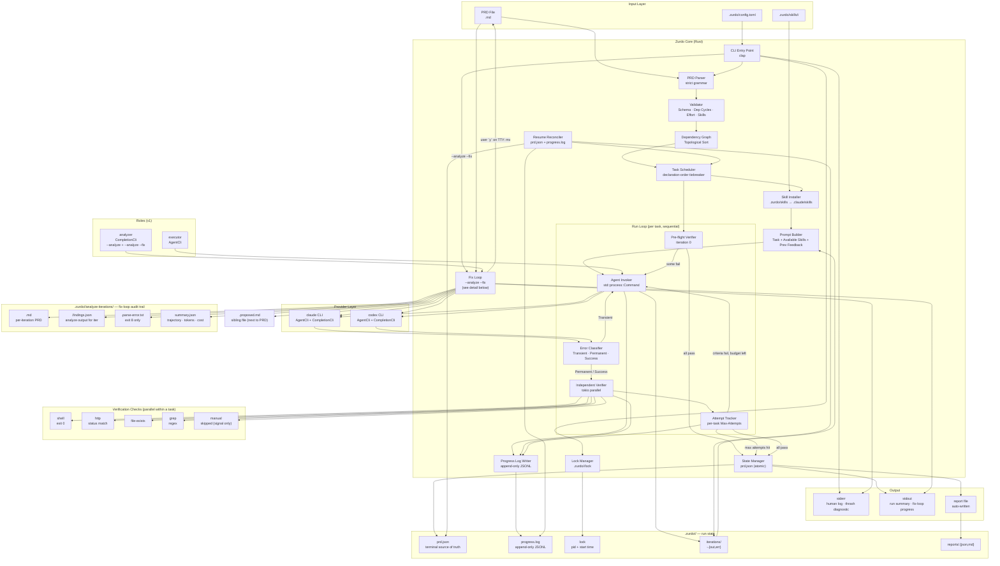
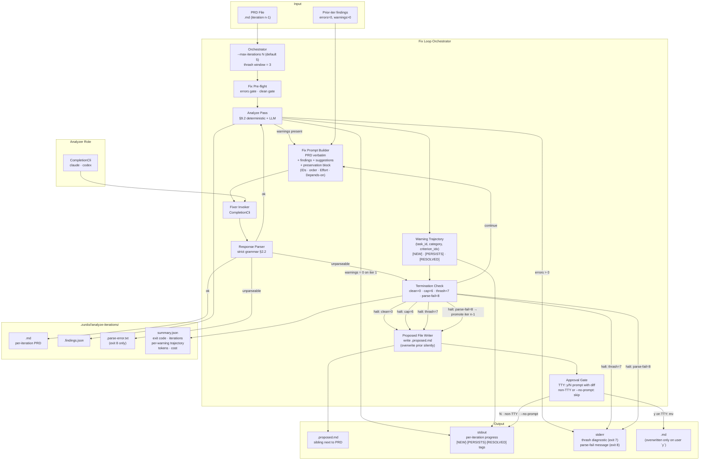

## Runtime overview

## Fix loop detail (`--analyze --fix`)

### Invariants captured in the fix-loop view

- **`CompletionCli` only.** No `AgentCli`, no working-tree mutation. The fixer rewrites the PRD text in its response; Zurdo writes the result.
- **Decoupled from run state.** The fix loop never reads or writes `prd.json` / `progress.log` / `iterations/` / `reports/`. Its audit trail lives in `.zurdo/<slug>/analyze-iterations/` and is overwritten on each invocation.
- **PRD mutation is single-edged.** The only arrow that overwrites `<prd>.md` is `FIXAPPROVE -->|y on TTY: mv| <prd>.md`. Every other halt path writes to the sibling `<prd>.proposed.md`.
- **Preservation block enforced at parse.** Task IDs, declaration order, `Effort`, and `Depends-on` violations land in the parse-fail path (exit `8`), not silently in `summary.json`.
- **Trajectory is the bridge.** `(task_id, finding_category, criterion_idx)` is what makes `[PERSISTS]` recognize a rewritten criterion as the same warning across iterations — and what feeds the §9.7.6 thrash diagnostic.
