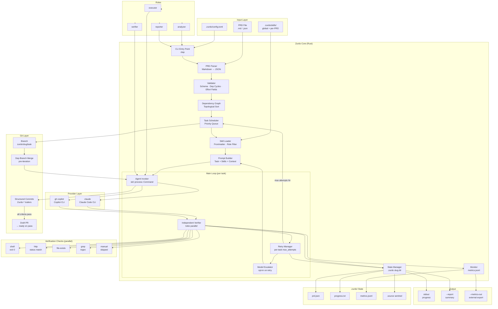

```mermaid
flowchart TD
    subgraph INPUT["Input Layer"]
        PRD["PRD File\n.md / .json"]
        CONFIG[".zurdo/config.toml"]
        SKILLS[".zurdo/skills/\nglobal + per-PRD"]
    end

    subgraph CORE["Zurdo Core (Rust)"]
        CLI["CLI Entry Point\nclap"]
        PARSER["PRD Parser\nMarkdown → JSON"]
        VALIDATOR["Validator\nSchema · Dep Cycles · Effort Fields"]
        DEPGRAPH["Dependency Graph\nTopological Sort"]
        SCHEDULER["Task Scheduler\nPriority Queue"]
        SKILLLOADER["Skill Loader\nFrontmatter · Role Filter"]
        PROMPTBUILDER["Prompt Builder\nTask + Skills + Context"]

        subgraph LOOP["Main Loop (per task)"]
            AGENT["Agent Invoker\nstd::process::Command"]
            VERIFIER["Independent Verifier\ntokio parallel"]
            RETRY["Retry Manager\nper-task max_attempts"]
            ESCALATOR["Model Escalator\nopt-in on retry"]
        end

        STATEMGR["State Manager\n.zurdo slug dir"]
        MONITOR["Monitor\nmetrics.jsonl"]
    end

    subgraph PROVIDERS["Provider Layer"]
        direction LR
        CLAUDE["claude\nClaude Code CLI"]
        COPILOT["gh copilot\nCopilot CLI"]
    end
	
	subgraph ROLES["Roles"]
        direction LR
        EXECUTOR["executor"]
        VERIFIERROLE["verifier"]
        ANALYZER["analyzer"]
        REPORTER["reporter"]
    end

    subgraph CHECKS["Verification Checks (parallel)"]
        direction LR
        SHELL["shell\nexit 0"]
        HTTP["http\nstatus match"]
        FILECHECK["file-exists"]
        GREP["grep\nregex"]
        MANUAL["manual\nskipped"]
    end

    subgraph GIT["Git Layer"]
        direction LR
        BRANCH["Branch\nzurdo/slug/task"]
        COMMIT["Structured Commits\nZurdo-* trailers"]
        PR["Draft PR\n→ ready on pass"]
        DEPMERGE["Dep Branch Merge\npre-iteration"]
    end

    subgraph STATE[".zurdo/ State"]
        direction LR
        PRDJSON["prd.json"]
        PROGRESS["progress.txt"]
        METRICS["metrics.jsonl"]
        SOURCE[".source sentinel"]
    end

	subgraph OUTPUT["Output"]
        direction LR
        STDOUT["stdout\nprogress"]
        REPORT["--report\nsummary"]
        METRICSOUT["--metrics-out\nexternal export"]
    end

    PRD --> PARSER
    CONFIG --> CLI
    SKILLS --> SKILLLOADER
    CLI --> PARSER
    PARSER --> VALIDATOR
    VALIDATOR --> DEPGRAPH
    DEPGRAPH --> SCHEDULER
    SCHEDULER --> SKILLLOADER
    SKILLLOADER --> PROMPTBUILDER
    PROMPTBUILDER --> AGENT

    ROLES --> EXECUTOR & VERIFIERROLE & ANALYZER & REPORTER
    EXECUTOR & VERIFIERROLE --> AGENT
    ANALYZER --> CLI
    REPORTER --> CLI

    AGENT --> CLAUDE & COPILOT
    CLAUDE & COPILOT --> VERIFIER

    VERIFIER --> SHELL & HTTP & FILECHECK & GREP & MANUAL
    VERIFIER --> RETRY
    RETRY --> ESCALATOR
    ESCALATOR --> PROMPTBUILDER
    RETRY -->|max attempts hit| SCHEDULER

	SCHEDULER --> BRANCH
    BRANCH --> DEPMERGE
    DEPMERGE --> AGENT
    AGENT --> COMMIT
    COMMIT -->|all criteria pass| PR

    VERIFIER --> STATEMGR & MONITOR
    RETRY --> STATEMGR
    STATEMGR --> PRDJSON & PROGRESS & SOURCE
    MONITOR --> METRICS

    STATEMGR --> STDOUT & REPORT
    MONITOR --> METRICSOUT
```